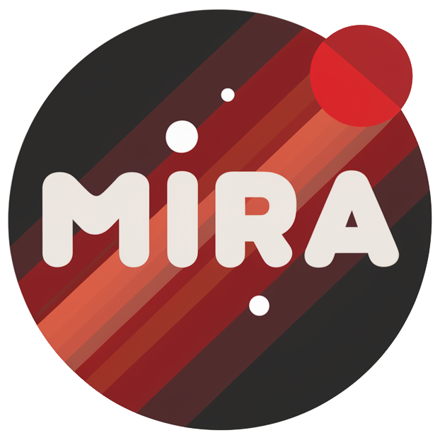

<p align="center">
    
</p>

#  Mira: A Preliminary Journey into Mini-Sora

We introduce Mira (Mini-Sora), an initial foray into the realm of high-quality, long-duration video generation in the style of Sora. Sora stands out from existing text-to-video (T2V) generation frameworks in several key ways:

* Extended sequence length: While most frameworks are limited to generating short videos (2 seconds / 16 frames), Sora is designed to produce significantly longer sequences, potentially lasting 10 seconds, 20 seconds, or more.

* Enhanced dynamics: Sora has the capability to create videos with rich dynamics and intricate motions, setting it apart from the more static outputs of current video generation technologies.

* Interactive objects and environments: Sora supports the generation of videos where objects and surroundings engage in dynamic interactions, adding a layer of complexity and realism. 

* Strong 3D consistency: Despite the intricate dynamics and object interactions, Sora ensures the 3D integrity of objects is preserved throughout the video, avoiding noticeable distortions.

* Sustained object consistency: Sora maintains consistent object shapes, even when they temporarily exit and re-enter the frame, ensuring continuity and coherence.


The Mira project is our endeavor to investigate and refine the entire data-model-training pipeline for Sora-like, lightweight T2V frameworks, and to preliminarily demonstrate the aforementioned Sora characteristics. Our goal is to foster innovation and democratize the field of content creation, paving the way for more accessible and advanced video generation tools.


## Results

**2 x 10s 384×240**

[](https://www.youtube.com/watch?v=EtCtrxSgUW0)

**2 x 20s 128×80**   

[](https://www.youtube.com/watch?v=Ywq4MQxoXHs)


## 📰 Updates

**Stay tuned!**  We are actively working on this project. Expect a steady stream of updates as we expand our dataset, enhance our annotation processes, and refine our model checkpoints. Keep an eye out for these upcoming updates, as we continue to make strides in our project's development.

**[2024.04.01]** 🔥 We're delighted to announce the release of **Mira** and **MiraData-v0**. This  release offers a comprehensive open-source suite for data annotation and training pipelines, specifically tailored for the creation of long-duration videos with dynamic content and consistent quality. Our provided codes and checkpoints empower users to generate videos up to 20 seconds in 128x80 resolution and 10 seconds in 384x240 resolution. Dive into the future of video generation with Mira!


## Installation
```bash
## create a conda enviroment
conda update -n base -c defaults conda 
conda create -y -n mira python=3.8.5 
source activate mira 

## install dependencies
pip install torch==2.0 torchvision torchaudio decord==0.6.0  \
einops==0.3.0  imageio==2.9.0 \
numpy omegaconf==2.1.1 opencv_python pandas \
Pillow==9.5.0 pytorch_lightning==1.9.0 PyYAML==6.0 setuptools==65.6.3  \
torchvision tqdm==4.65.0 transformers==4.25.1 moviepy av  tensorboardx \
&& pip install  timm scikit-learn  open_clip_torch==2.22.0 kornia simplejson easydict pynvml rotary_embedding_torch==0.3.1 triton  cached_property  \
&& pip install xformers==0.0.18 \
&& pip install taming-transformers fairscale deepspeed  diffusers
```

## Training

### Finetuning the Mira-v0 model on 128x80 resolution.

* Add path to your datasets and the pretrain models in [config_384_mira.yaml](configs/Mira/config_384_mira.yaml).
* Then conduct the following commands:

```bash
## activate envrionment
conda activate mira


## Run training
bash configs/Mira/run_128_mira.sh 0
```

### Finetuning the Mira-v0 model on 384x240 resolution.

* Add path to your datasets and the pretrain models in [config_128_mira.yaml](configs/Mira/config_128_mira.yaml).
* Then conduct the following commands:
  
```bash
## activate envrionment
conda activate mira

## Run training
bash configs/Mira/run_384_mira.sh 0
```

## Inference

###  Evaluate the Mira-v0 model on 128x80 resolution.

* Add path to your model checkponits in [run_text2video.sh](configs/inference/run_text2video.sh).
* Add your test prompts in [test_prompt.txt](prompts/test_prompt.txt).
* Then conduct the following commands:
  
```bash
## activate envrionment
conda activate mira

## Run inference
bash configs/inference/run_text2video.sh

```

### Evaluate the Mira-v0 model on 384x240 resolution.

* Add path to your model checkponits in [run_text2video_384.sh](configs/inference/run_text2video_384.sh).
* Add your test prompts in [test_prompt.txt](prompts/test_prompt.txt).
* Then conduct the following commands:
  
```bash
## activate envrionment
conda activate mira

## Run inference
bash configs/inference/run_text2video_384.sh

```

